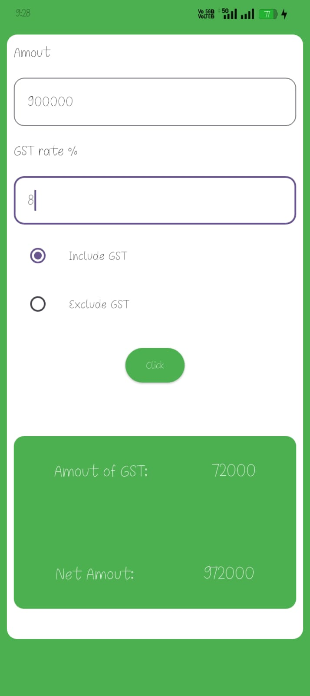
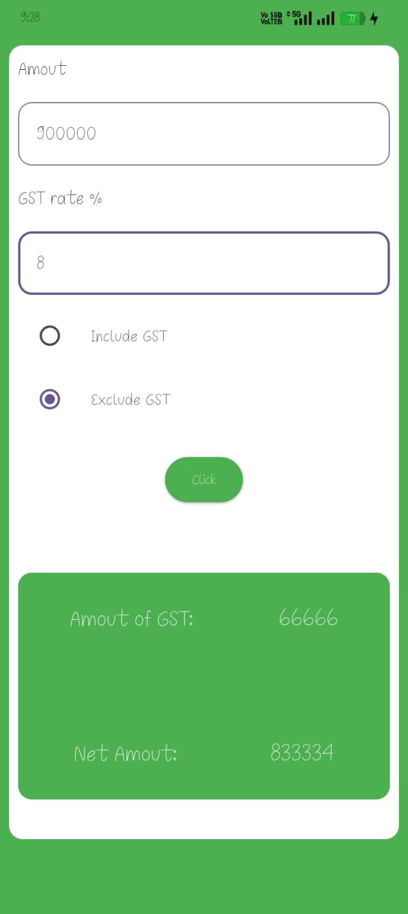
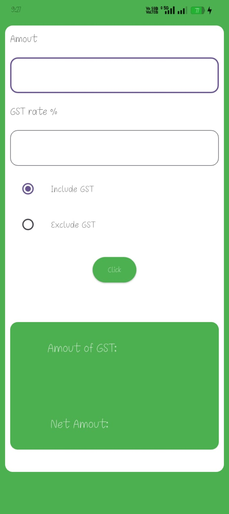
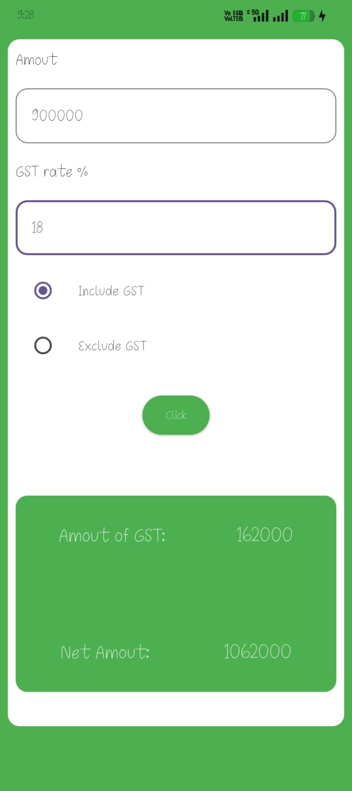
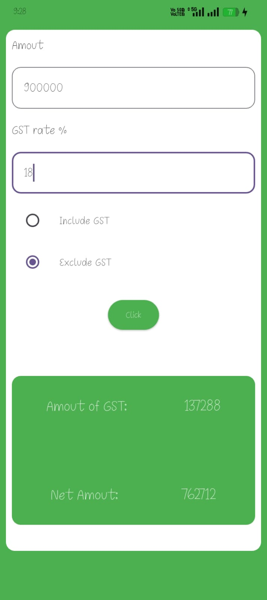

# 📊 GST Calculator App (Flutter)

A simple and user-friendly **GST Calculator App** built using **Flutter**. This app helps users quickly calculate GST amounts, including **CGST**, **SGST**, and **Net Amount**, based on whether GST is included or excluded.

---

## 🚀 Features

* 💰 Enter base amount
* 📈 Enter GST rate (%)
* 🔘 Choose:

  * Include GST
  * Exclude GST
* 🧮 Automatic calculation of:

  * CGST (Central GST)
  * SGST (State GST)
  * Total GST
  * Net Amount
* 🎨 Clean and responsive UI
* 📱 Mobile-friendly design

---

## 📸 Screenshots

*Add your app screenshots here*

```
screenshots/
   ├── screen1.png
   ├── screen2.png
   ├── screen3.png
```

---

## 🛠️ Tech Stack

* **Flutter**
* **Dart**
* Material UI Widgets

---

## 📂 Project Structure

```
lib/
 ├── main.dart
 ├── screens/
 │     └── my_screen.dart
 └── widgets/
```

---

## ⚙️ How It Works

### 1. Exclude GST

* GST is calculated on entered amount
* Formula:

```
GST = (Amount × Rate) / 100
CGST = GST / 2
SGST = GST / 2
Net Amount = Amount + GST
```

### 2. Include GST

* GST is already included in amount
* Formula:

```
GST = (Amount × Rate) / (100 + Rate)
CGST = GST / 2
SGST = GST / 2
Net Amount = Amount - GST
```

---

## ▶️ Getting Started

### Prerequisites

* Flutter SDK installed
* Android Studio / VS Code

### Run the App

```bash
flutter pub get
flutter run
```

---

## 📌 Future Improvements

* ✅ Add decimal support (double instead of int)
* 🎯 Input validation (empty / invalid values)
* 🌙 Dark mode support
* 💾 Save calculation history
* 🌍 Multi-language support

---

## 🙌 Contribution

Feel free to fork this repository and contribute!

```bash
git clone https://github.com/yogeshgmakvana/gst-calculator.git
```
<h2>📸 App Screenshots</h2>

<div style="display: flex; flex-wrap: wrap; gap: 10px; justify-content: center;">

  
  
  
  
  

</div>

## 👨‍💻 Developer

**Yogesh Makwana**
Flutter Developer 🚀

---

⭐ If you like this project, don't forget to **star the repo**!
